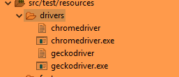

Solution:

Identification of High-Risk Areas:

1\. Functionality of the Login Screen The functionality of the login screen is an essential component of the program because it is responsible for user authentication. A single flaw or security hole in this part of the system can put the whole thing at risk.

2\. The processing of payments The processing of payments is another essential part of the application. It deals with sensitive information pertaining to users, and any failure or gap in security in this area can result in monetary loss as well as legal complications.

3\. Search Functionality Search functionality is crucial since it gives the user a method to browse and find products. This makes search functionality an essential component. Any problem in this area can result in an unfavorable experience for the user, which can lead to a loss of money.

4\. Product Management: The product management area is extremely important since it is responsible for ensuring that the appropriate products are presented, that the appropriate prices are charged, and that the appropriate information about the products is displayed. If there is a flaw or a gap in this area, it may cause users to become confused and mistrustful.

5\. Checkout Functionality Because it involves the completion of the purchase, the checkout functionality is an essential part of the program. Any kind of error or problem in this section can result in customers giving up on their purchases and a drop in revenue.

Selected Risks and Automated Tests:

1. Login Functionality: Automated Test Scenario: 

• Open the demo webshop URL and navigate to the login page. 

• Enter invalid login credentials and click on the login button.

` `• Verify that the error message is displayed correctly. 

• Enter valid login credentials and click on the login button. 

• Verify that the user is logged in successfully.

Justification: As mentioned earlier, the login functionality is an essential part of the application, and any vulnerability in this area can compromise the entire system. Hence it is crucial to test this functionality with invalid and valid inputs.

2. Search Functionality Search functionality: 

• Open the demo webshop URL and navigate to the payment page. 

• Enter a search item and click search

• Verify the correct search item is displayed

Justification: If I am searching for item, the correct item should be displayed unrelated items in the search could lead to loss of revenue as it might be difficult to find what the user needs

Improvement:

Given more time, we can improve the automated tests by adding more test scenarios for the identified high-risk areas. We can also include other test frameworks like Cypress, and PlayWright to improve test coverage. Additionally, we can integrate the test suite with a continuous integration tool like Jenkins or azure pipeline to automate the build and test process. Finally, we can generate test reports and metrics to provide better visibility into the testing process.

Building and Running Automated Tests:

1. Clone the repository from GitHub: git clone https://github.com/hmir992/ui\_cucumber\_framework\_v2.git
1. Open the project as maven project in IntelliJ 
1. Find build -> build project in IntelliJ it will compile. If you face any issues make sure you have java jdk 8 installed
1. Locate the TestRunner1.java or TestRunner2.java and right click and run the either runners to see the tests run.

**Detailed instructions on how to run automated tests:**

**How to run these tests:** 

**Please Note I don’t have a mac so I don’t know if the drivers in the project work.** 

**The project was tested in windows**

**Java JDK 8 is needed as a requirement on the machine or it wont work**

Download the project from here:

- <https://github.com/hmir992/ui_cucumber_framework_v2/tree/main/cucumberFramework-main>
- git clone
- open project in IntelliJ 
- Download the correct Windows or Mac Driver and paste it into the folder cucumberFramework-main/src/test/resources/drivers

Download the drivers here:

<https://github.com/mozilla/geckodriver/releases/tag/v0.28.0> for FireFox

<https://chromedriver.chromium.org/home> for chrome

After that just go to project root in cmd or terminal:

To run the tests with cucumber jvm report

mvn clean 

mvn clean test 

mvn verify  

/cucumberFramework-main/target/cucumber-reports/advanced-reports/cucumber-html-reports/  to see the generated cucumber report

Allure reports can be generated by the following:

mvn clean 

mvn clean test 

mvn site

mvn jetty:run

Go to <http://localhost:8080/> to see the allure report

**Sample Reporting:**

**Cucumber jvm**

**Allure report:**

